# Devoir-1-CSI2532

## Partie A [60 points]: Modèles E-R

### A1 [15 points]: Relations, cardinalité et participation

a) [5 points] Un étudiant peut être supervisé par plusieurs professeurs, et un professeur peut
superviser plusieurs étudiants. Un étudiant a un numéro d'étudiant, un nom et est inscrit dans
un programme spécifique. Un professeur a un numéro d'employé, nom et domaine d'expertise

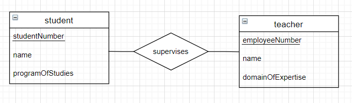

b) [5 points] Toutes les sections de cours doivent être affectées à un cours. Un cours a un code
de département (par exemple CSI ou SEG) et un numéro de cours (par exemple 2532 ou 4105).
Une section de cours est défini uniquement par le nom de la section (par exemple A ou B ou C),
semestre (par exemple hiver), l'année et le cours lui-même. Une section de cours dépend sur le
cours.

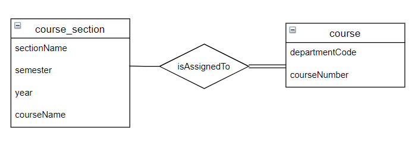

c) [5 points] Une entreprise a un nom et un quartier général (spécifié par pays). Un conseil d'administration a
un président, un vice-président, et secrétaire (juste leurs noms). Une entreprise peut avoir au
plus un conseil administrateurs (mais il n'en a pas besoin). Tout les conseils d'administration
doivent avoir une et une seule entreprise à gérer.

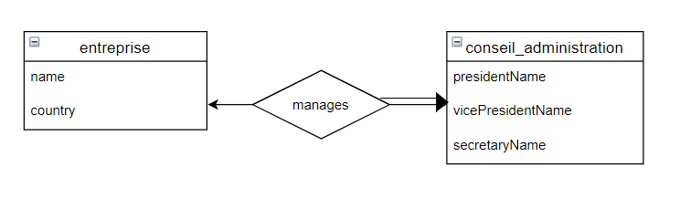

### A2 [30 points]: Conception du système

On vous demande de concevoir une base de données (à l'aide d'un diagramme relationnel)
CorporateBnB, une entreprise qui permet à toutes les personnes ayant un bureau à domicile de
fournir des espaces de réunion à d'autres. Tous les utilisateurs peut s'inscrire à ce service en
fournissant leur nom, email et numéro de téléphone. Un utilisateur peut gérer un espace de
bureau, ou peut louer un espace de bureau. Un bureau a un nom, une adresse et une superficie
totale (en pieds carrés). Chaque bureau a la disponibilité pour quand il peut être loué. La
disponibilité stocke la date et le coût quotidien pour l'utilisation, les heures d'arrivée et de départ
et si cette date est toujours disponible. Lorsqu'un utilisateur loue une propriété, on stock la date
d'arrivée et la date de départ.
Modélisez le système ci-dessus à l'aide d'un diagramme Entité-Relation. Vous devez inclure les
entités, les relations, la cardinalité, la participation et les attributs. Vous n'avez pas besoin de
spécifier les types d'attributs (c'est-à-dire le domaine).

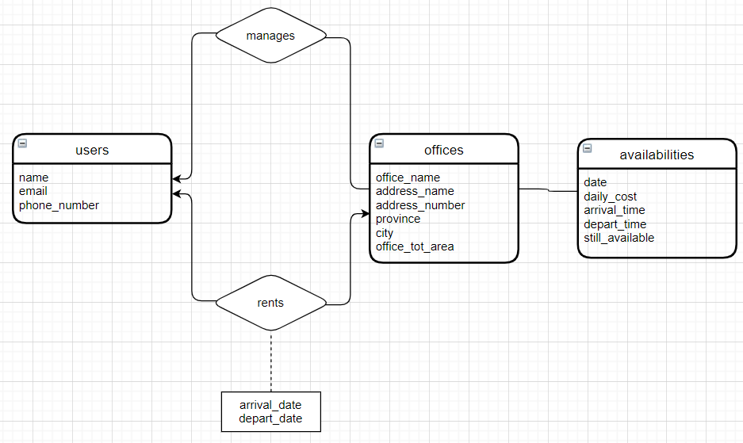


### A3 [15 points]: Algèbre relationnelle

a) [7 points] Trouvez tous les espaces de bureau à Ottawa qui sont disponibles le 2 mars 2020

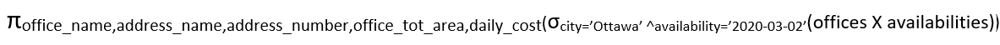


b) [8 points] Trouvez tous les utilisateurs (nom et email) et les détails de la propriété (nom et
ville) et les informations de location (date et coût quotidien) de toutes les bureaux loués du mois
de janvier 2020.

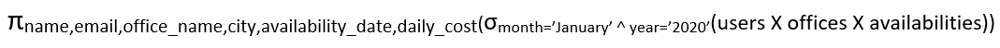


## Partie B [60 points]: SQL

### B1. [15 points] Lecture de requêtes SQL
a) [4 points]
```sql
SELECT
 name,
 EXTRACT(year from age(users.join_date)) AS experience
FROM users
JOIN licenses ON licenses.user_id = users.id
WHERE licenses.software_name = 'MS Word'
ORDER BY users.name;
```

Le code sql ci-dessus fonctionnait comme prévu. Il permettait d'extraire l'année de la table des utilisateurs et permettait également de joindre les licenses des utilisateurs avec le logiciel pour lequel le nom était MS Word. Finalement, tous les résultats sont triés (ordonnés) en fonction des noms des utilisateurs. Voici le résultat obtenu:


b) [4 points]
```sql
SELECT name,
 released_date
FROM softwares
WHERE released_date < '2018-01-01'
ORDER BY released_date ASC;
```
Pour cette partie, le code sql ci-dessus sélectionner deux colonnes (name et released_date) de la table _softwares_ avec une condition particulière: Il fallait que la date de distribution du logiciel ce soit faite avant le 01 janvier 2018. De plus, tous les résultats étaient ordonnés par date de distribution en order croissant(ascendant). Voici le résultat obtenu:


c) [7 points]
```sql
WITH users_2019 (id, name) AS
 (SELECT *
 FROM users
 WHERE join_date BETWEEN '2019-01-01' AND '2019-12-31')
SELECT id,
 name,
 count(licenses.access_code) AS num
FROM users_2019
LEFT JOIN licenses ON licenses.user_id = id
GROUP BY name
ORDER BY num DESC;
```
Après avoir fait plusieurs recherches sur internet, j’ai découvert que la raison pour laquelle cette requête ne fonctionnait pas était dû au fait que la ligne à laquelle ‘’GROUP BY NAME’’ était écrit devait également contenir le user_2019.id afin de pouvoir s’assurer que la requête s’exécute comme prévu. Voici donc le nouveau code modifié:
```sql
WITH users_2019 (id, name) AS
 (SELECT *
 FROM users
 WHERE join_date BETWEEN '2019-01-01' AND '2019-12-31')
SELECT id,
 name,
 count(licenses.access_code) AS num
FROM users_2019
LEFT JOIN licenses ON licenses.user_id = id
GROUP BY name, users_2019.id
ORDER BY num DESC;
```
De plus, voici la sortie que j'ai obtenu ensuite:


### B2. [15 points] Écriture de requêtes SQL
a) [3 points] Trouvez les noms de tous les utilisateurs qui se sont inscrits avant le 1er janvier
2020
```sql
SELECT NAME FROM users WHERE join_date<'2020-01-01';
```
Voici ainsi la sortie obtenue:

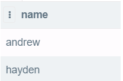

b)	[5 points] Trouvez le nombre de licences logicielles de chaque utilisateur (même celles sans licence). Triez les résultats par nombre de licences (du plus au moins), puis par nom (A - Z).
```sql
SELECT users.name, count(licenses.user_id) as number_of_licenses
from users
left join licenses on licenses.user_id = users.id
group by users.name
order by number_of_licenses desc, name asc;
```

Sortie obtenue:

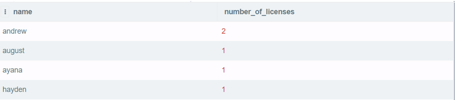

c)	[5 points] Insérez des données dans la base de données pour démontrer que les résultats sont triés correctement en (b).

Insertion de données:

```sql
INSERT INTO users (id, name, join_date)
VALUES
 (52, 'andrew2', '2018-02-01'),
 (53, 'hayden2', '2019-02-02'),
 (54, 'august2', '2020-02-02'),
 (55, 'ayana2', '2020-02-01');
 
INSERT INTO softwares (name, version, released_date)
VALUES
 ('Excel', '2010', '2011-02-20'),
 ('Edge', '2006', '2018-02-01'),
 ('Python', '3.8', '2016-07-15');
 
INSERT INTO licenses (user_id, software_name, access_code)
VALUES
 (52, 'Python', 'abc1234'),
 (53, 'Edge', 'def4564'),
 (54, 'Excel', 'hij7894'),
 (55, 'Python', 'x1y2z34'),
 (49, 'Sketch', 'x2y3z44');
```

Sortie obtenue:

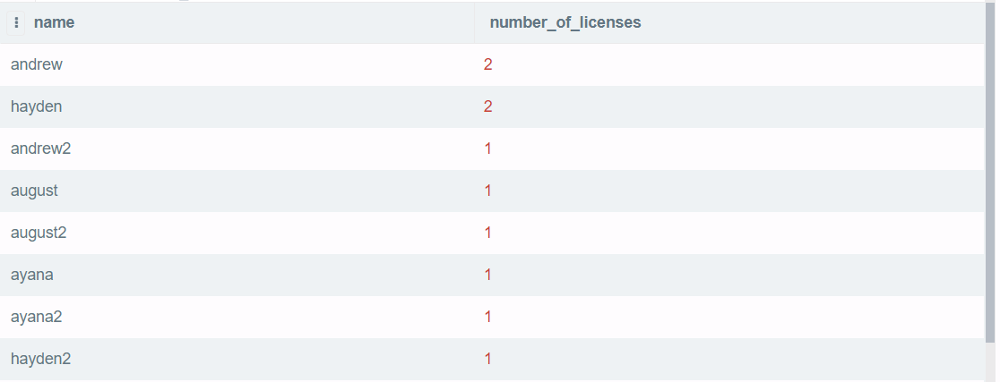

d)	[2 points] Mettez à jour la version de sketch à la version « 51 » (publié le 1 janvier 2020).

Code sql:
```sql
update softwares
set version = '51',
released_date = '2020-01-01'
where name = 'Sketch';
```

Résultat obtenu:


### B3. [30 marks] Mise à jour du schéma SQL

a) [5 points] Ajoutez la version du logiciel à la table des licences.
```sql
BEGIN;
ALTER TABLE licenses
ADD COLUMN software_version varchar(100);
UPDATE licenses
SET software_version = s.version
FROM softwares as s
WHERE licenses.software_name = s.name;
COMMIT;
```
Résultats:
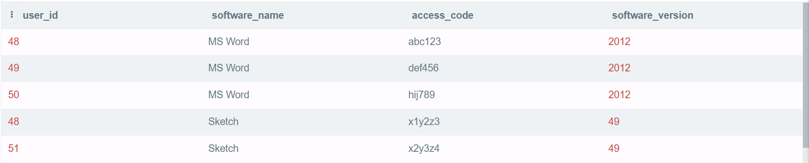

b) [5 points] Mettez à jour la table des softwares pour inclure le nom ET la version comme clé
primaire.
```sql
BEGIN;
ALTER TABLE softwares DROP CONSTRAINT softwares_pkey;
ALTER TABLE softwares ADD PRIMARY KEY (name, version);
COMMIT;
```
Résultat à partir de psql:
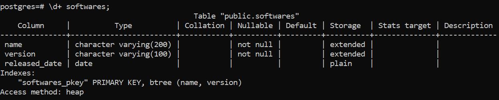

c) [10 points] Mettez à jour le tableau des licences pour permettre aux utilisateurs d'avoir
plusieurs versions du même logiciel. Pour démontrer cela, ajoutez Sketch 52 à l'utilisateur
"andrew" avec le code d'accès "xxxyyy111". Ne codez pas directement avec l'ID de utilisateur,
cela devrait fonctionner pour n'importe quelle instances de la base de données avec un
utilisateur nommé "andrew".
```sql
BEGIN;
ALTER TABLE licenses
DROP CONSTRAINT licenses_user_id_fkey;
ALTER TABLE licenses
DROP CONSTRAINT licenses_pkey;
ALTER TABLE licenses
ADD PRIMARY KEY (user_id,software_name,software_version);
ALTER TABLE licenses
ADD FOREIGN KEY (user_id) REFERENCES users;
ALTER TABLE licenses
ADD FOREIGN KEY (software_name,software_version) REFERENCES softwares;
COMMIT;
```
Ensuite, code pour ajouter l'utilisateur demandé:
```sql
INSERT INTO licenses (user_id, software_name,software_version,access_code)
SELECT id,'Sketch','52','xxxyyy111'
FROM users
WHERE users.name='andrew';
```

Résultat:
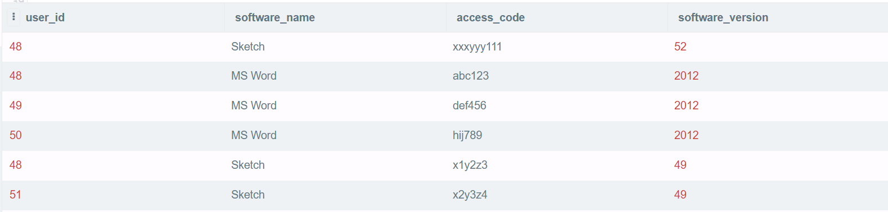

d) [10 points] Sketch propose une promotion (code d'accès "1monthfree") pour la version 52.
Donnez cette licence à tous ceux qui ne l'ont pas encore, leur permettant de conserver toute
ancienne version qu'ils pourraient avoir. Ne codez pas directement la liste des utilisateurs, cela
devrait fonctionner pour n'importe quelle instances de la base de données.
